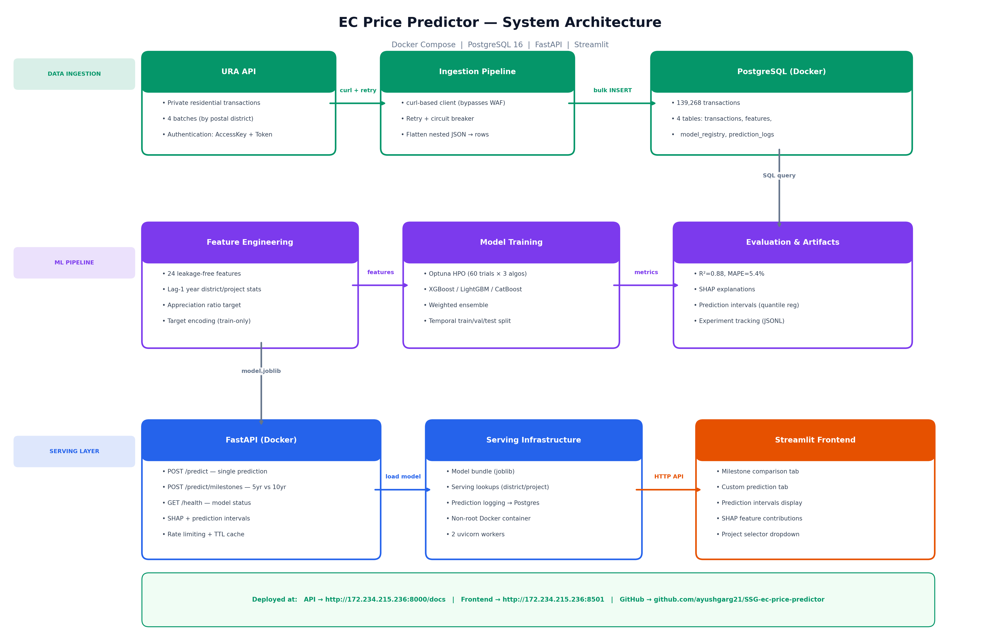
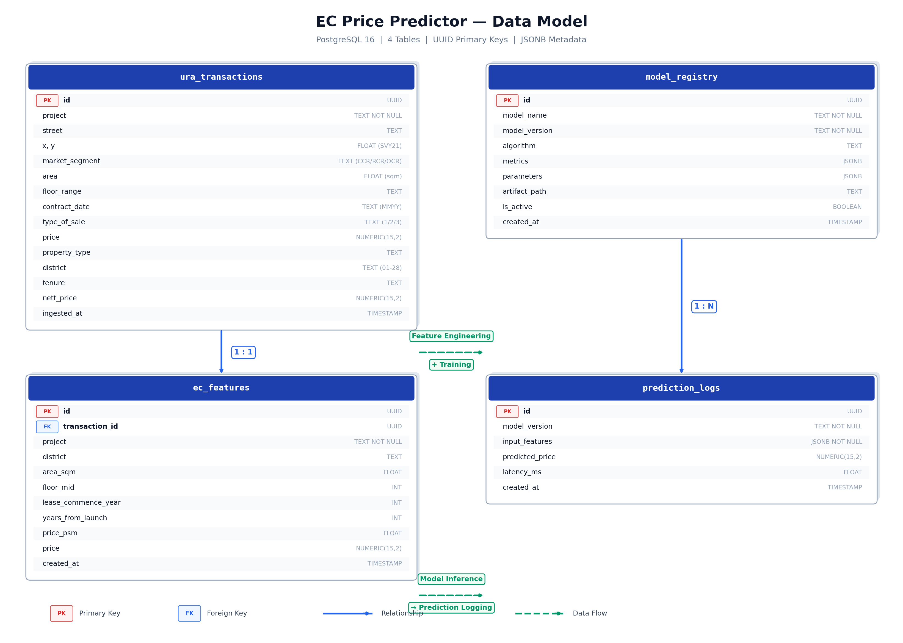

# EC Price Predictor

End-to-end ML system for predicting Executive Condominium (EC) resale prices in Singapore at two key lifecycle milestones:

- **5 years** — Minimum Occupancy Period (MOP), when units become eligible for resale
- **10 years** — Privatisation, when ECs become indistinguishable from private condominiums

## Live Demo

| Resource | URL |
|----------|-----|
| **Frontend (Streamlit)** | http://172.234.215.236:8501 |
| **API (Swagger Docs)** | http://172.234.215.236:8000/docs |
| **API Health Check** | http://172.234.215.236:8000/health |

## Architecture



## Data Model



## Model Approach

### Problem Reframing
Rather than predicting absolute price, the model predicts the **appreciation ratio** from launch price:

```
predicted_price = appreciation_ratio × launch_psm × area_sqm
```

This removes price-level variance and focuses on what drives appreciation: location, age, floor level, and market conditions. See [docs/HANDOVER.md](docs/HANDOVER.md) for the full model evolution story.

### Performance (Zero Leakage)

| Metric | Value |
|--------|-------|
| **R²** | **0.892** |
| **MAPE** | **4.91%** |
| **MAE** | **S$83,195** |
| Algorithm | LightGBM (weighted ensemble available) |
| Features | 24 (all leakage-free, lagged) |
| Training data | 10,140 resale transactions |
| Test period | 2026 (unseen during training) |

## Quick Start

### Prerequisites
- Docker Desktop
- Python 3.11+
- URA API access key ([register here](https://www.ura.gov.sg/maps/api/))

### Setup

```bash
cp .env.example .env          # Add your URA_ACCESS_KEY
make install                   # Install dependencies
make db                        # Start Postgres
make ingest                    # Fetch 139k URA transactions
python notebooks/01_eda.py     # EDA (8 figures) — or open 01_eda.ipynb
python notebooks/02_appreciation_model.py  # Train model (16 figures)
```

### Run

```bash
# Terminal 1: API
make serve                     # http://localhost:8000

# Terminal 2: Frontend
make streamlit                 # http://localhost:8501
```

### Docker (full stack)
```bash
docker compose up -d --build
```

## API

Interactive docs at **http://localhost:8000/docs**

| Method | Path | Description |
|--------|------|-------------|
| GET | `/health` | Health check + model status |
| POST | `/predict` | Single prediction with SHAP explanations + 80% prediction interval |
| POST | `/predict/milestones` | MOP (5yr) vs privatisation (10yr) comparison with intervals |

### Example

```bash
curl -X POST http://localhost:8000/predict/milestones \
  -H "Content-Type: application/json" \
  -d '{"district": 19, "area_sqm": 95, "floor": 8, "lease_commence_year": 2020, "project": "PIERMONT GRAND"}'
```

```json
{
  "mop_5yr_price": 1578103.18,
  "mop_5yr_interval": {"lower_bound": 1504214.52, "upper_bound": 1563793.09, "confidence": "80%"},
  "privatised_10yr_price": 1670258.66,
  "privatised_10yr_interval": {"lower_bound": 1595523.13, "upper_bound": 1646748.05, "confidence": "80%"},
  "price_appreciation": 92155.48,
  "appreciation_pct": 5.84,
  "currency": "SGD"
}
```

## Project Structure

```
├── src/
│   ├── api/                      # FastAPI + caching + rate limiting + prediction logging
│   ├── features/
│   │   ├── engineering.py        # Base feature extraction
│   │   └── serving.py            # Serving-time feature construction (uses lookups)
│   ├── ingestion/
│   │   ├── ura_client.py         # URA API client (curl, retry + circuit breaker)
│   │   ├── ingest.py             # Flatten → validate → Postgres
│   │   └── validation.py         # Pandera schemas
│   ├── model/
│   │   ├── train.py              # Programmatic training API
│   │   ├── predict.py            # Inference (appreciation model + intervals)
│   │   ├── explain.py            # SHAP per-prediction explanations
│   │   ├── experiment.py         # JSONL experiment tracking
│   │   └── ensemble.py           # Weighted ensemble regressor
│   ├── config.py
│   └── database.py               # SQLAlchemy + prediction logging
├── notebooks/
│   ├── 01_eda.ipynb / .py        # Exploratory data analysis (8 figures)
│   ├── 02_appreciation_model.ipynb / .py  # Full training pipeline (16 figures)
│   └── figures/                  # All generated plots
├── artifacts/                    # Trained model + serving lookups + experiment log
├── tests/                        # Unit + integration tests
├── docs/
│   ├── HANDOVER.md               # Complete solution walkthrough
│   ├── data_model.pdf            # Database schema diagram
│   ├── architecture.md           # System design
│   ├── monitoring.md             # Proposed monitoring strategy
│   ├── automation.md             # Proposed automation strategy
│   ├── governance.md             # Proposed governance framework
│   └── limitations.md            # Honest limitations analysis
├── frontend/
│   ├── app.py                    # Streamlit UI with prediction intervals
│   └── index.html                # Lightweight HTML fallback
├── scripts/                      # CLI tools
├── docker-compose.yml
├── Dockerfile
├── Makefile                      # make serve, make test, make all
└── pyproject.toml                # Pinned dependencies
```

## Testing

```bash
make test          # Unit tests
make test-all      # Include integration tests (requires Docker)
make lint          # Ruff linting
```

## Key Features

| Feature | Implementation |
|---------|---------------|
| **Appreciation model** | Predicts ratio from launch price, not absolute price |
| **Zero leakage** | All features use strictly prior-year data; audited 3 times |
| **Prediction intervals** | XGBoost quantile regression (80% PI) |
| **SHAP explanations** | Per-prediction feature contributions |
| **Retry + circuit breaker** | URA client with exponential backoff |
| **Rate limiting + caching** | Per-IP sliding window + TTL cache |
| **Prediction logging** | Every prediction logged to Postgres |
| **Experiment tracking** | JSONL run log with metrics comparison |

## Documentation

- [Handover](docs/HANDOVER.md) — Complete solution walkthrough (start here)
- [Data Model](docs/data_model.pdf) — Database schema diagram
- [Architecture](docs/architecture.md) — System design and data flow
- [Monitoring](docs/monitoring.md) — Proposed metrics and alerting
- [Automation](docs/automation.md) — Feature engineering, model selection, monitoring automation
- [Governance](docs/governance.md) — Access controls, versioning, validation, audit trail
- [Limitations](docs/limitations.md) — Honest analysis of model limitations
